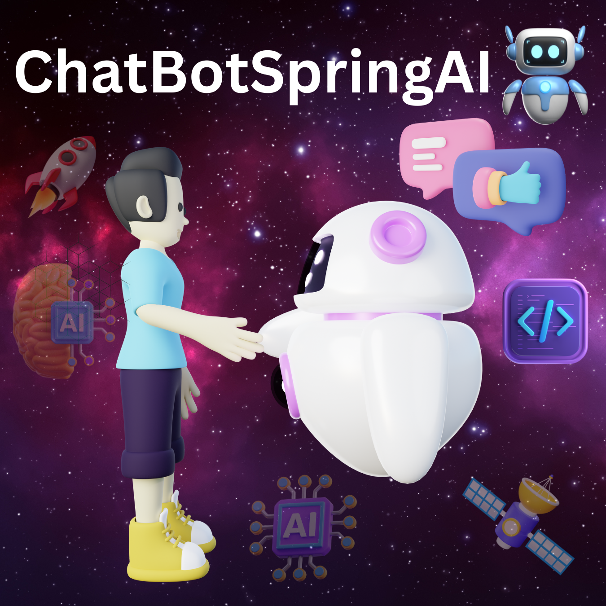

<h1 align="center">ChatBotSpringAI 🤖</h1>




## Description 🗣️💬

Welcome to ChatBotSpringAI, the ultimate Spring Boot project that brings an intelligent chatbot to life! 🎉🚀 Engage in conversations like never before, powered by the incredible ChatGPT API from OpenAI. Get ready for an adventure full of amazing interactions and brilliant responses! 🌟💬

## Table of Contents 📑📚

- [Installation](#installation)
- [Usage](#usage)
- [API Integration](#api-integration)
- [Configuration](#configuration)
- [Contributing](#contributing)
- [Acknowledgements](#acknowledgements)

## Installation 💻🛠️

Let's get started on this exciting journey! To run ChatBotSpringAI on your local machine, follow these super simple steps:

1. Clone the repository to your computer. 🚀💻
2. Make sure you have Java and Maven installed. If not, don't worry, we've got you covered! 😎🌟
3. Grab an API key from the OpenAI platform. It's like the secret sauce for the magic! 🔑✨
4. Set the API key as an environment variable or securely store it in the application.properties file. Safety first! 🔒🔐
5. Build the project using Maven. Boom! 💥💥
6. Run the Spring Boot application. Here we go! 🏃‍♂️🏃‍♀️

## Usage 🚀🗨️

Once the ChatBot is up and running, get ready to have a blast! 🎉🎉 Interact with the ChatBot by making HTTP POST requests to the awesome endpoint we've set up. Send your text prompt as the request body, and brace yourself for the incredible answers! 🤯💬

Example API Request:

```http
POST /chat
Content-Type: application/json

{
  "textPrompt": "Tell me a joke!"
}
```

Example API Response:

```json
{
  "response": "Why don't scientists trust atoms? Because they make up everything!"
}
```

## API Integration ⚙️🔌

ChatBotSpringAI is now officially connected to the mind-blowing OpenAI ChatGPT API. Get ready to experience the power of cutting-edge technology as we dive deep into the world of AI-powered conversations! 🤖⚡

## Configuration 🔧⚙️

Customize your chatbot experience like a boss! 🎩🎉 Modify the application.properties file to tweak the API endpoint URL, adjust model settings, and fine-tune parameters for the most sensational chat responses. 🌟💬

## Tools Used 🛠️

<table align="center">
  <tr>
    <td align="center" width="100">
      <br>
      Java
    </td>
    <td align="center" width="100">
      <br>
      Maven
    </td>
    <td align="center" width="100">
      <br>
      Spring Boot
    </td>
    <td align="center" width="100">
      <br>
      RESTful API
    </td>
  </tr>
  <tr>
    <td align="center" width="100">
      <br>
      Lombok
    </td>
    <td align="center" width="100">
      <br>
      STS
    </td>
    <td align="center" width="100">
      <br>
      GitHub
    </td>
    <td align="center" width="100">
      <br>
      Postman
    </td>
  </tr>
</table>


## Contributing 🤝🎉

Hey, we're in this together! We're thrilled to welcome contributions from all the awesome developers out there. Join the ChatBotSpringAI community and let's make it even better! 🙌🤩


## Acknowledgements 🙏🌟

A huge shoutout to the incredible developers and researchers at OpenAI. Your groundbreaking work on the ChatGPT model is an inspiration to all of us! 🌟✨ Thank you for making this project a reality.

---

Let's make this README a celebration of the awesome ChatBotSpringAI project! 🥳🎉 The world of AI-powered chat awaits, and we can't wait to see what exciting conversations await us! 💬💬

Feel free to use this enthusiasm-filled README or add even more excitement and personal touches to make it uniquely yours. Let's spread the joy of technology with ChatBotSpringAI! 🌟🤖
